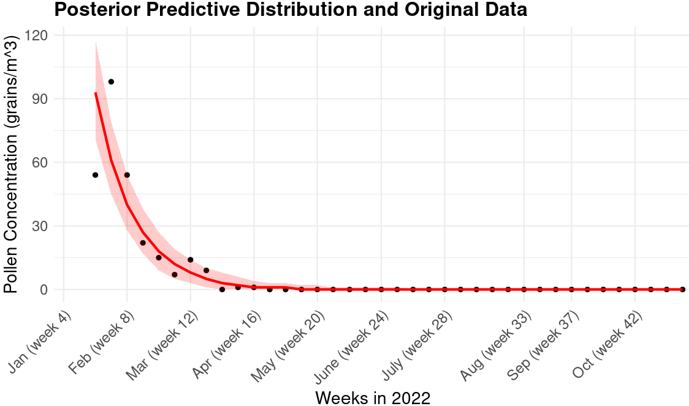
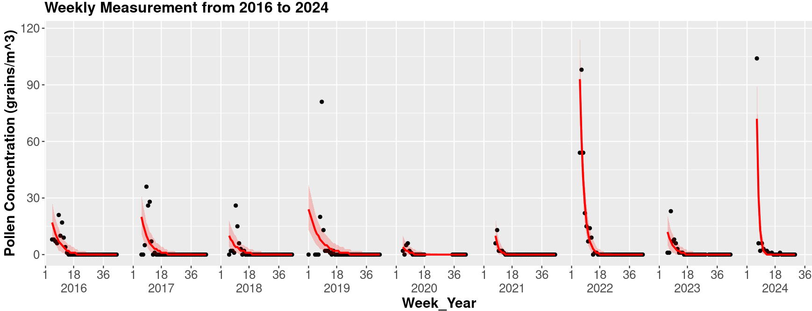

# Pollen_Prediction
 Modelling weekly Alnus pollen concentrations in Becej, Serbia during the period 2016 to 2024. This is the assignment submission as part of the Bayesian Data Analysis course at Aalto 2024.

